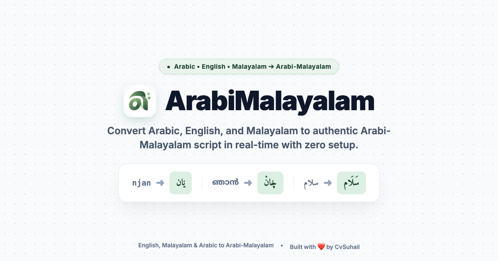

<div align="center">

  

  # ArabiMalayalam (അറബി-മലയാളം)
  
  **Intelligent, real-time Arabi-Malayalam transliterator, phonetic keyboard & document editor.**

  [](https://arabimalayalam.online/)
  [](https://www.typescriptlang.org/)
  [](https://react.dev/)
  [](https://vitejs.dev/)
  [](https://dexie.org/)
  [](LICENSE)
  [](https://www.cvsuhail.online/)

  <br />

  <p align="center">
    <a href="https://arabimalayalam.online/"><strong>Live Web App</strong></a> •
    <a href="#-key-features"><strong>Key Features</strong></a> •
    <a href="#-arabi-malayalam-script-matrix"><strong>Script Matrix</strong></a> •
    <a href="#-pwa-mobile-experience"><strong>PWA Install</strong></a> •
    <a href="#-getting-started"><strong>Quick Start</strong></a> •
    <a href="#-author--credits"><strong>Author</strong></a>
  </p>

  

</div>

---

## 📖 Overview

**ArabiMalayalam** is a modern, high-performance web and mobile application designed to preserve and revitalize **Arabi-Malayalam** (അറബി-മലയാളം / اَرَبِ مَلَیَالَمْ) — the traditional writing system of the Mappila community in Malabar, Kerala. 

It enables effortless typing and real-time transliteration from **English (Manglish)**, **Malayalam Unicode**, and **Standard Arabic** into authentic Arabi-Malayalam script, featuring classical font rendering, vowel diacritics, and offline Progressive Web App (PWA) functionality.

---

## ✨ Key Features

- **⚡ Multi-Source Real-Time Transliteration**:
  - **English (Manglish) ➔ Arabi-Malayalam**: Type naturally using English letters (e.g., `njan` ➔ `ݧان`, `keralam` ➔ `كِيرَڶَم`, `onnu` ➔ `اُونُّ`).
  - **Malayalam ➔ Arabi-Malayalam**: Directly paste or type Malayalam Unicode (e.g., `ഞാൻ` ➔ `ݧان`, `വെള്ളം` ➔ `وَيڶَّم`).
  - **Arabic ➔ Arabi-Malayalam**: Auto-adapts Arabic text into Malayalam-phonetic Arabi-Malayalam forms.
- **🎯 Floating Suggestion Dropdown**:
  - Appears right below the active word being typed with numbered candidate suggestions.
  - Quick selection using number keys (`1`–`6`) or `Spacebar`.
  - Verbatim fallback candidate ensures custom spellings are never lost.
- **🔤 Comprehensive Phonetic Alphabet Support**:
  - Implements the complete set of Arabi-Malayalam modified letters (`ݧ`, `ڞ`, `ڰ`, `ڔ`, `ڶ`, `ڹ`, `ژ`, `ٹ`, `ڈ`, `پ`, `چ`).
  - Distinct short-vowel marks for **'e' (٘)** and **'o' (ٗ)** alongside standard harakat (`َ`, `ِ`, `ُ`, `ْ`, `ّ`).
- **📱 Native-Quality Progressive Web App (PWA)**:
  - Installable on mobile devices (iOS Safari and Android Chrome).
  - Native iOS-style bottom sheet installation prompt on initial launch.
  - Zero-scroll sticky formatting toolbar tailored specifically for mobile touchscreens.
- **💾 Local-First & 100% Private**:
  - Automatic background saving powered by browser **IndexedDB**.
  - All transliteration executes client-side; zero data sent to external servers.
- **🎨 Classical Typography & Fonts**:
  - Preview your writing in authentic calligraphy and typefaces: *Amiri*, *Noto Naskh Arabic*, *Scheherazade New*, *Lateef (Nastaliq)*, *Aref Ruqaa*, *Noto Sans Arabic*, *Harmattan*, and *Reem Kufi*.
- **🎙️ Speech-to-Text Voice Typing**:
  - Built-in microphone dictation for fast hands-free writing.
- **📤 Export & Sharing**:
  - Download formatted `.txt` files with clean slugified filenames or instant one-click clipboard copy.

---

## 🔠 Arabi-Malayalam Script Matrix

Arabi-Malayalam adapts the Arabic alphabet to represent Dravidian Malayalam phonetic sounds that do not exist in standard Arabic:

| Malayalam Letter | Arabi-Malayalam Glyph | Unicode Code | Name / Phonetic Sound | Example Transliteration |
|:----------------:|:---------------------:|:------------:|:----------------------|:------------------------|
| **ഞ** | **ݧ** | `U+0767` | Arabic letter Noon with two dots above (`nja`) | *njan* ➔ `ݧان` |
| **ങ** | **ڞ** | `U+069E` | Arabic letter Sad with three dots above (`nga`) | *thenga* ➔ `تَيڞَ` |
| **ഗ** | **ڰ** | `U+06B0` | Arabic letter Gaf with ring (`ga`) | *keralam* ➔ `كِيرَڶَم` |
| **റ** | **ڔ** | `U+0694` | Arabic letter Reh with small V below (`rra`) | *paranju* ➔ `پَرَݧُ` |
| **ള** | **ڶ** | `U+06F6` | Arabic letter Lam with small V (`lla`) | *vellam* ➔ `وَيڶَّم` |
| **ണ** | **ڹ** | `U+06B9` | Arabic letter Noon with retroflex dot (`Nna`) | *kannu* ➔ `كَنُّ` |
| **ഴ** | **ژ** | `U+0698` | Arabic letter Jeh / Zhe (`zha`) | *mazha* ➔ `مَژَ` |
| **ട** | **ٹ** | `U+0679` | Arabic letter Tteh (`Tta`) | *paatam* ➔ `پَاٹَم` |
| **ഡ** | **ڈ** | `U+0688` | Arabic letter Ddal (`Dda`) | *veedu* ➔ `وِيڈ` |
| **പ** | **پ** | `U+067E` | Arabic letter Peh (`pa`) | *poyi* ➔ `پَويِ` |
| **ച** | **چ** | `U+0686` | Arabic letter Tcheh (`cha`) | *cheythath* ➔ `چَيتَتْ` |

### Special Vowel Marks

| Sound | Diacritic | Unicode | Usage |
|:-----:|:---------:|:-------:|:------|
| **എ (Short e)** | `٘` | `U+0658` | Small inverted mark below letter to represent short Dravidian 'e' |
| **ഒ (Short o)** | `ٗ` | `U+0657` | Inverted damma mark above letter to represent short Dravidian 'o' |

---

## 📱 PWA & Mobile Experience

ArabiMalayalam is engineered as a standalone Progressive Web App:

- **iOS (iPhone/iPad)**:
  1. Open [arabimalayalam.online](https://arabimalayalam.online/) in **Safari**.
  2. Tap the **Share** button ($\uparrow$) at the bottom of Safari.
  3. Scroll down and tap **Add to Home Screen**.
- **Android**:
  1. Open in **Google Chrome**.
  2. Tap **Install ArabiMalayalam** on the bottom sheet prompt or from the browser menu.
- **Offline Access**:
  - Service Worker (`sw.js`) caches static assets, web fonts, and application bundles so the editor remains fully accessible without internet.

---

## 🛠️ Tech Stack & Architecture

- **Framework**: [TanStack Start](https://tanstack.com/start/latest) with [TanStack Router](https://tanstack.com/router)
- **UI Library**: [React 19](https://react.dev/)
- **Bundler & Build Tool**: [Vite 8](https://vitejs.dev/) with [Rolldown](https://rolldown.rs/)
- **Styling**: [Tailwind CSS](https://tailwindcss.com/) with custom font definitions
- **Storage**: [Dexie.js](https://dexie.org/) (Client-side IndexedDB wrapper)
- **Transliterator Engines**:
  - [`arabic-malayalam-transliterator`](https://github.com/naswihmohd/arabic-malayalam-transliterator)
  - [`@piraisoodan/tanglish`](https://github.com/piraisoodan/tanglish) (Manglish phonetics)
  - Custom enhanced multi-script rule parser with Dravidian short vowel support
- **Icons**: [Lucide React](https://lucide.dev/)
- **Notifications**: [Sonner](https://sonner.emilkowal.ski/)

---

## 🚀 Getting Started

### Prerequisites

- [Node.js](https://nodejs.org/) (version 18+ recommended)
- `npm` or `pnpm` / `bun`

### Installation

1. **Clone the repository**:
   ```bash
   git clone https://github.com/CvSuhail/arabiMalayalamKeyboard.git
   cd arabiMalayalamKeyboard
   ```

2. **Install dependencies**:
   ```bash
   npm install
   ```

3. **Start the development server**:
   ```bash
   npm run dev
   ```
   Open [http://localhost:8080](http://localhost:8080) in your browser.

4. **Build for production**:
   ```bash
   npm run build
   ```

5. **Preview production build**:
   ```bash
   npx vite preview
   ```

---

## 🌐 SEO, GEO & AIO Optimization

ArabiMalayalam includes enterprise-grade optimizations for traditional search engines (Google, Bing) and AI Answer Engines (Perplexity, ChatGPT Search, Claude, Google Gemini):

- **Structured Data (JSON-LD)**:
  - `WebApplication` schema with full feature list and system specifications.
  - `FAQPage` schema addressing common questions about Arabi-Malayalam script.
  - `Person` author schema linking directly to creator profiles.
- **`llms.txt` Standard**:
  - Implements the modern `/llms.txt` standard for AI web crawlers (GPTBot, ClaudeBot, PerplexityBot) with full phonetic alphabet specifications and orthography guides.
- **Open Graph & Twitter Cards**:
  - Rich 1200×630 social preview cards (`/og-image.png`).
- **Sitemap & Robots**:
  - Auto-configured `sitemap.xml` with multilingual alternate hints (`en`, `ml`, `ar`) and crawl directives in `robots.txt`.

---

## 💬 Feedback & Contributions

Contributions, bug reports, and script suggestions are warmly welcome!

- **WhatsApp Direct**: Have suggestions or found a transliteration edge case? [Message on WhatsApp (+91 95627 70397)](https://wa.me/919562770397?text=Hi%20ArabiMalayalam%20Team)
- **Submit Pull Requests**: Feel free to submit PRs for new font support, vocabulary enhancements, or UI improvements.

---

## 👨‍💻 Author & Credits

Designed and built with ❤️ by **CvSuhail**.

- **Portfolio**: [cvsuhail.online](https://www.cvsuhail.online/)
- **Contact**: [+91 95627 70397](https://wa.me/919562770397)

---

## 📄 License

This project is licensed under the [MIT License](LICENSE).
